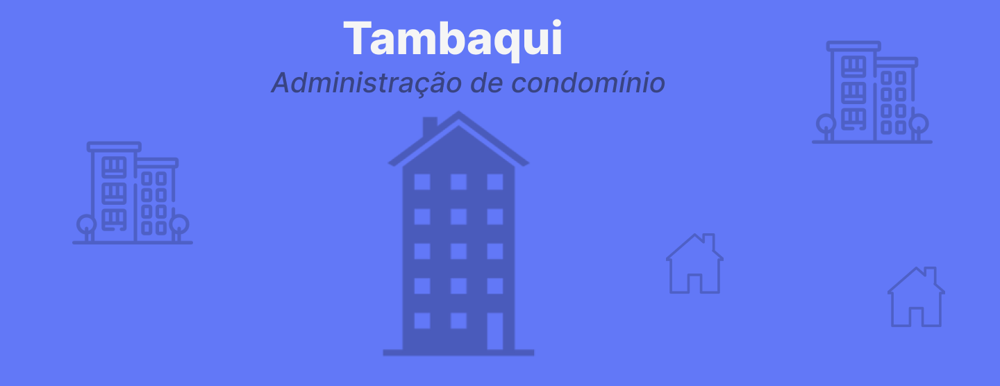

# Organograma do Condomínio

SPA React educacional do curso **Desenvolvimento de Aplicações para Internet**.  
Evolução do projeto incompleto estilo Alura Organo, adaptado para papéis de condomínio (síndico, condômino, porteiro, zelador, conselho fiscal).



> Branding **Tambaqui** · cor marca `#6278F7` · UI em **pt-BR**.

## Como rodar

```bash
npm install
npm start          # http://localhost:3000
npm run test:ci    # testes
npm run build      # build de produção
```

No console do navegador você verá `[MSW] API mock ativa em /api/*` — isso **não** é um backend real.

## Stack (resumo)

| Camada | Tecnologia |
|--------|------------|
| UI | React 18 + CRA (`react-scripts` 5) |
| Rotas | React Router DOM 6 |
| Estado | Zustand (+ persist localStorage) |
| Formulários | React Hook Form + Zod |
| HTTP mock | Axios + **MSW** (`/api/*`) |
| IDs / datas | nanoid · date-fns |
| Ícones / toast | lucide-react · sonner |
| Gráficos | Recharts |
| SEO títulos | react-helmet-async |
| Estilo util | clsx |
| Qualidade | PropTypes · ESLint · Prettier · Jest/RTL |

Detalhes: [`docs/TECNOLOGIAS.md`](docs/TECNOLOGIAS.md) · [`docs/APIS.md`](docs/APIS.md) · [`docs/ARQUITETURA.md`](docs/ARQUITETURA.md)

## Funcionalidades

1. Formulário controlado com validação (nome, e-mail, telefone com máscara, time, observações, imagem opcional)
2. Código de acesso **opcional** (demo): armazenado só como hash em `authBlob` — **nunca** nos cards
3. Organograma por times com cores editáveis
4. Busca por nome, exclusão, empty state
5. Painel com gráfico (Recharts) por time
6. Exportação JSON do organograma
7. Persistência localStorage via Zustand
8. Páginas: Organograma, Cadastro, Painel, Sobre

## Estrutura

```
organograma-condominio/
  public/imagens/     # tambaqui.png, banner.png
  src/
    api/              # cliente axios
    components/       # Banner, Formulario, CampoTexto, …
    data/times.js
    hooks/
    i18n/ptBR.js
    mocks/            # MSW handlers (API mock)
    pages/
    store/            # Zustand
    utils/validation.js
  docs/
  original-snapshot/  # fontes originais quebradas (comparação pedagógica)
```

## Objetivos de aprendizagem

- Componentização React e props
- Estado elevado / store global
- Formulários controlados + schema Zod
- Persistência no browser
- Mock de API com MSW (sem inventar backend falso)
- Acessibilidade básica (labels, alt, keys)
- CSS moderno com variáveis e layout responsivo

## Screenshots

> Placeholders — rode `npm start` e capture:

- `[screenshots/organograma.png]` — home com cards por time  
- `[screenshots/cadastro.png]` — formulário  
- `[screenshots/painel.png]` — gráfico Recharts  

## Licença

MIT — ver [`LICENSE`](LICENSE).
